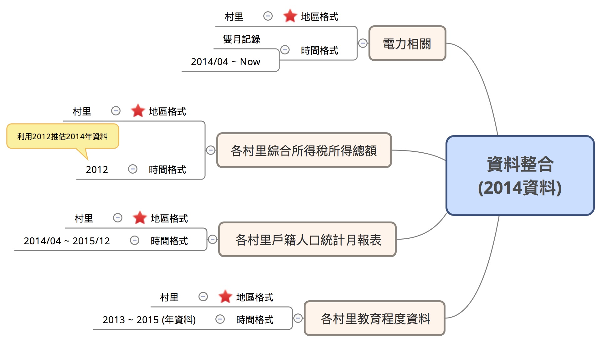
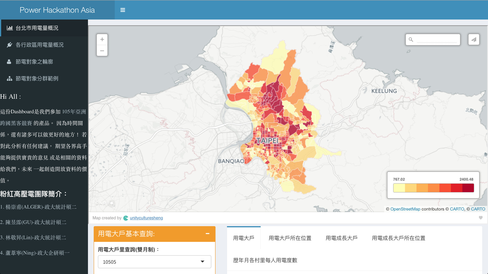

# Speaker
## Yupei Chen

__國立政治大學統計研究所碩二__

#### __Experience__

  * 玉山金控資料探勘實習生(2015.1-2015.2)
  * HTC Data Insight Management Summer Intern(2015.7-2015.8)
  * 全國大專院校商業個案大賽(ATCC) IBM組企業第三名
  * R 軟體翻轉教室教學助教
  * 健保資料庫分析團隊
  * DSP 實習研究員

#### __Skills__

  * R、SQL、SAS

</img>

# 節電？從何節起？
## 人人喊節電，各個沒實踐
#### **Problem**

- 夏季尖峰用電年年創新高
- 政府每年編列高額節電預算效果不甚顯著
- 台電提核一廠2號機將不停機，後年提前除役！[新聞來源](https://www.thenewslens.com/article/49678)

#### **Solution**

- 幫助政府能更有效率的分配節電預算
- 運用開放資料找出問題間的關聯性

# 讓資料來說話
## 資料盤點
- 電力資料 X 人口統計 X 經濟指標

</img>

## 資料整合
- 五大資料集：村里電力、戶籍人口、教育程度、生死結離、所得總額

</img>

## Raw Data

</img>

## 資料分析

1. 資料蒐集、整合與清理
2. 變數選取與合併
3. 臺北市整體與各行政區用電量概況(探索性資料分析)
3. 六大指標：
    - 女男比、平均教育程度、扶老比、有偶比例、每戶平均用電度數、綜合所得中位數
4. 分群分析 X 雷達圖(臺北市456個村里分為8群)
5. 視覺化：地圖 X 用電量
6. 電力分析 Dashboard -- **Easytricity**

# 未來如果可以...
## 給政府的小小淺見
* 更細緻化最小單位
    - 村里 to 最小統計區
    - 月資料 to 日資料
    - 工業用電、民生用電、商業用電
    - etc.
* 更完整的資料年份
* 更即時的資料資訊
* 繼續優化 **Easytricity** !

# It's demo time !

## Our products{.centered}

- [北市電力分析 Dashboard](https://dspim.github.io/data-labs/Power_Preliminary#motivation-and-goal)

</img>

## Our products{.centered}

- [Easytricity](https://qazwsx36541472.shinyapps.io/Power_HackathonAsia-master/)

</img>
